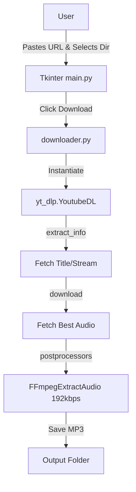

# Developer & Technical Documentation

This document provides a technical guide to the **Mp3Downloader** application's architecture and execution.

---

## System Architecture

The application connects a Tkinter view straight into the `yt_dlp` Python class wrapper.



---

## Directory Structure & File Roles

```
.
├── main.py             # Tkinter graphical interface and entry logic
├── downloader.py       # Wrapper housing the yt_dlp options dictionary and execution logic
├── README.md           # General overview
└── Documentation.md    # Technical documentation
```

---

## Workflow

The execution flow of Mp3Downloader:
1. **Initialization**: `main.py` opens a 600x200 `Tk()` window and listens on a `tk.Entry`.
2. **Action Trigger**: User inputs data and clicks Download. The `clicked()` function grabs `entry_url.get()` and fires `download(url, output_path)`.
3. **Processing**: Inside `downloader.py`, a `Path` object is created to bind the directory to a standard `yt_dlp` `outtmpl`. The `ydl_opts` dictionary enforces `format: bestaudio/best` and queues the `FFmpegExtractAudio` post-processor targeting `192` quality.
4. **Output Generation**: `ydl.download([url])` executes the stream fetch. Once FFmpeg completes its conversion, the resulting sanitized title is bubbled back to Tkinter via `Path(...).stem` to trigger the `messagebox.showinfo` alert.

---

## Launcher Compilation Guide

Because the `postprocessors` rely heavily on external binary execution, `ffmpeg` must be natively installed on the host OS.

### Compilation or Execution Commands

Execute the following commands in order within your terminal:

```powershell
# Install the Youtube-DL fork
pip install yt-dlp

# Start the application
python main.py
```
